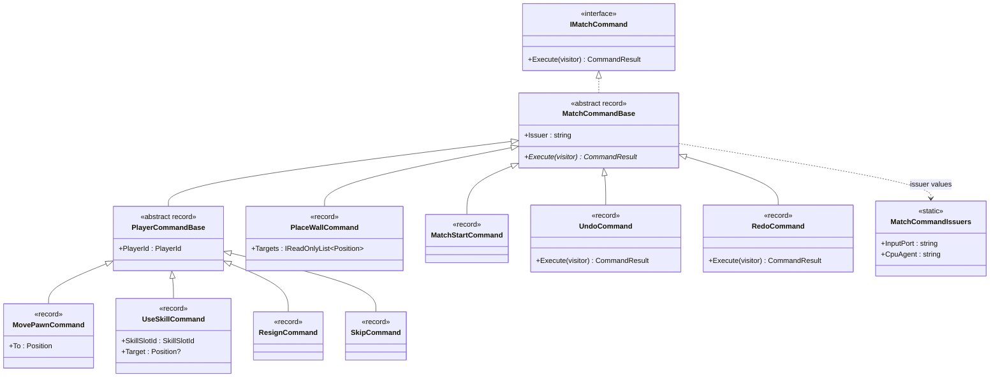
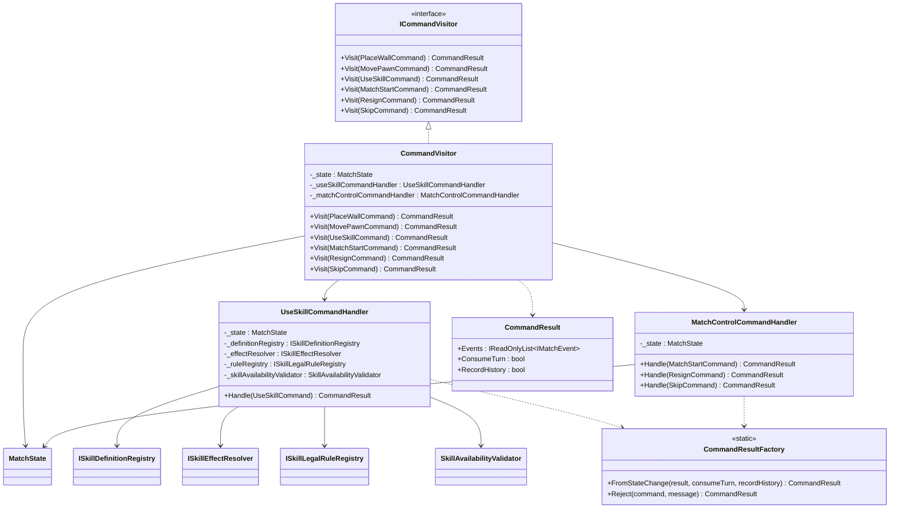
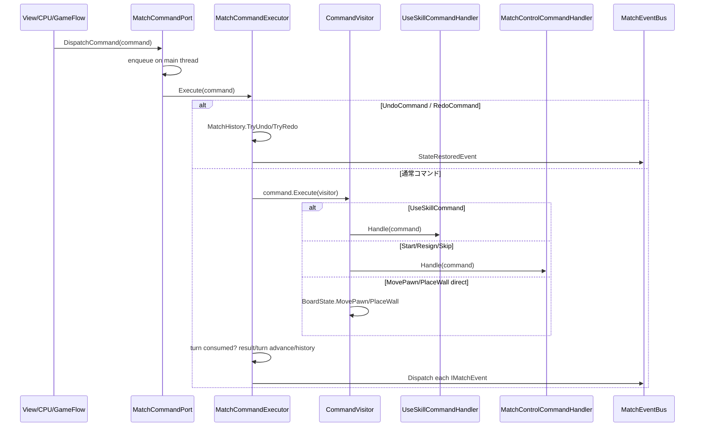

# Command / Command Handling

## Command クラス図

```mermaid
classDiagram
    class IMatchCommand{
        <<interface>>
        +Execute(visitor) CommandResult
    }

    class MatchCommandBase{
        <<abstract record>>
        +Issuer : string
        +Execute(visitor) CommandResult*
    }
    IMatchCommand <|.. MatchCommandBase

    class PlayerCommandBase{
        <<abstract record>>
        +PlayerId : PlayerId
    }
    MatchCommandBase <|-- PlayerCommandBase

    class MovePawnCommand{
        <<record>>
        +To : Position
    }
    PlayerCommandBase <|-- MovePawnCommand

    class UseSkillCommand{
        <<record>>
        +SkillSlotId : SkillSlotId
        +Target : Position?
    }
    PlayerCommandBase <|-- UseSkillCommand

    class ResignCommand{
        <<record>>
    }
    PlayerCommandBase <|-- ResignCommand

    class SkipCommand{
        <<record>>
    }
    PlayerCommandBase <|-- SkipCommand

    class PlaceWallCommand{
        <<record>>
        +Targets : IReadOnlyList~Position~
    }
    MatchCommandBase <|-- PlaceWallCommand

    class MatchStartCommand{
        <<record>>
    }
    MatchCommandBase <|-- MatchStartCommand

    class UndoCommand{
        <<record>>
        +Execute(visitor) CommandResult
    }
    MatchCommandBase <|-- UndoCommand

    class RedoCommand{
        <<record>>
        +Execute(visitor) CommandResult
    }
    MatchCommandBase <|-- RedoCommand

    class MatchCommandIssuers{
        <<static>>
        +InputPort : string
        +CpuAgent : string
    }
    MatchCommandBase ..> MatchCommandIssuers : issuer values
```

## Command Handling クラス図

```mermaid
classDiagram
    class ICommandVisitor{
        <<interface>>
        +Visit(PlaceWallCommand) CommandResult
        +Visit(MovePawnCommand) CommandResult
        +Visit(UseSkillCommand) CommandResult
        +Visit(MatchStartCommand) CommandResult
        +Visit(ResignCommand) CommandResult
        +Visit(SkipCommand) CommandResult
    }

    class CommandVisitor{
        -_state : MatchState
        -_useSkillCommandHandler : UseSkillCommandHandler
        -_matchControlCommandHandler : MatchControlCommandHandler
        +Visit(PlaceWallCommand) CommandResult
        +Visit(MovePawnCommand) CommandResult
        +Visit(UseSkillCommand) CommandResult
        +Visit(MatchStartCommand) CommandResult
        +Visit(ResignCommand) CommandResult
        +Visit(SkipCommand) CommandResult
    }
    ICommandVisitor <|.. CommandVisitor

    class UseSkillCommandHandler{
        -_state : MatchState
        -_definitionRegistry : ISkillDefinitionRegistry
        -_effectResolver : ISkillEffectResolver
        -_ruleRegistry : ISkillLegalRuleRegistry
        -_skillAvailabilityValidator : SkillAvailabilityValidator
        +Handle(UseSkillCommand) CommandResult
    }

    class MatchControlCommandHandler{
        -_state : MatchState
        +Handle(MatchStartCommand) CommandResult
        +Handle(ResignCommand) CommandResult
        +Handle(SkipCommand) CommandResult
    }

    class CommandResult{
        +Events : IReadOnlyList~IMatchEvent~
        +ConsumeTurn : bool
        +RecordHistory : bool
    }

    class CommandResultFactory{
        <<static>>
        +FromStateChange(result, consumeTurn, recordHistory) CommandResult
        +Reject(command, message) CommandResult
    }

    CommandVisitor --> MatchState
    CommandVisitor --> UseSkillCommandHandler
    CommandVisitor --> MatchControlCommandHandler
    UseSkillCommandHandler --> ISkillDefinitionRegistry
    UseSkillCommandHandler --> ISkillEffectResolver
    UseSkillCommandHandler --> ISkillLegalRuleRegistry
    UseSkillCommandHandler --> SkillAvailabilityValidator
    MatchControlCommandHandler --> MatchState
    CommandVisitor ..> CommandResult
    UseSkillCommandHandler ..> CommandResultFactory
    MatchControlCommandHandler ..> CommandResultFactory
```

## Command 実行フロー

```mermaid
sequenceDiagram
    participant Caller as View/CPU/GameFlow
    participant Port as MatchCommandPort
    participant Executor as MatchCommandExecutor
    participant Visitor as CommandVisitor
    participant SkillHandler as UseSkillCommandHandler
    participant ControlHandler as MatchControlCommandHandler
    participant Bus as MatchEventBus

    Caller->>Port: DispatchCommand(command)
    Port->>Port: enqueue on main thread
    Port->>Executor: Execute(command)
    alt UndoCommand / RedoCommand
        Executor->>Executor: MatchHistory.TryUndo/TryRedo
        Executor->>Bus: StateRestoredEvent
    else 通常コマンド
        Executor->>Visitor: command.Execute(visitor)
        alt UseSkillCommand
            Visitor->>SkillHandler: Handle(command)
        else Start/Resign/Skip
            Visitor->>ControlHandler: Handle(command)
        else MovePawn/PlaceWall direct
            Visitor->>Visitor: BoardState.MovePawn/PlaceWall
        end
        Executor->>Executor: turn consumed? result/turn advance/history
        Executor->>Bus: Dispatch each IMatchEvent
    end
```
