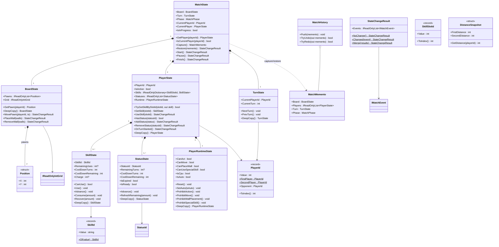
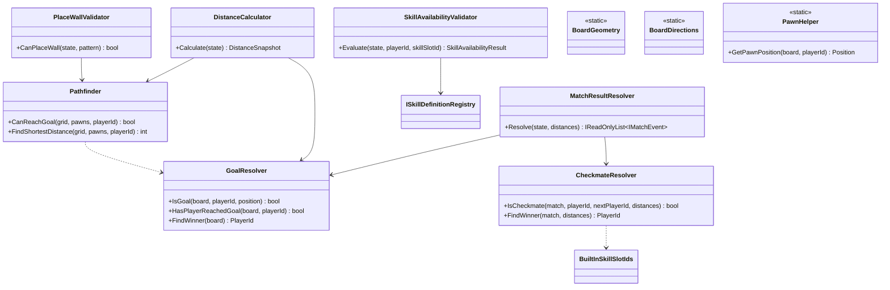

# Domain

## State / Value Object クラス図

## Rule / Service クラス図

## Enum / Value 一覧

| 種別 | 値 |
|---|---|
| `MatchPhase` | Ready, InProgress, Paused, Finished |
| `PlayerSide` | First, Second |
| `WallDirection` | Horizontal, Vertical |
| `SkillActivationType` | Immediate, BoardTarget |
| `SkillTargetKind` | None, Tile, Wall |
| `SkillTargetPlayerPolicy` | Self, Opponent, Any |
| `StatusEffectId` | CannotAct, ProbabilisticCannotAct, CannotMovePawn, CannotPlaceWall, CannotUseSpecialSkill, RecoveryWall, DamageWall |
| `StatusReapplyPolicy` | Ignore, Refresh, Stack |
| `StatusId` | Sleep, Paralysis, SealMovePawn, SealPlaceWall, SealSpecialSkill, RecoveryWall, DamageWall |
