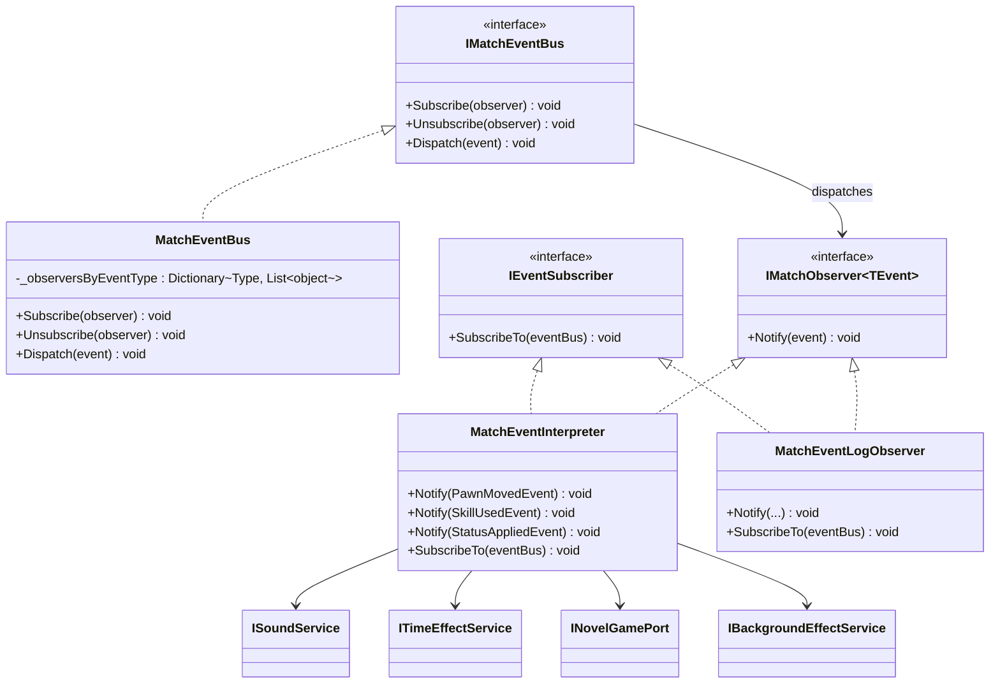

# Event

## Event クラス図

```mermaid
classDiagram
    class IMatchEvent{
        <<interface>>
        +Dispatch(eventBus) void
    }

    class MatchEventBase{
        <<abstract>>
        +Dispatch(eventBus) void*
    }
    IMatchEvent <|.. MatchEventBase

    class BoardTargetEventBase{
        <<abstract>>
        +Target : Position
    }
    MatchEventBase <|-- BoardTargetEventBase

    class BoardTargetsEventBase{
        <<abstract>>
        +Targets : IReadOnlyList~Position~
    }
    MatchEventBase <|-- BoardTargetsEventBase

    class PlayerTargetEventBase{
        <<abstract>>
        +PlayerId : PlayerId
    }
    MatchEventBase <|-- PlayerTargetEventBase

    class PawnMovedEvent{
        +PlayerId : PlayerId
        +Target : Position
    }
    BoardTargetEventBase <|-- PawnMovedEvent

    class WallPlacedEvent
    class WallRemovedEvent
    BoardTargetsEventBase <|-- WallPlacedEvent
    BoardTargetsEventBase <|-- WallRemovedEvent

    class MatchReadiedEvent
    class MatchStartedEvent
    class TurnStartedEvent{
        +CurrentTurn : int
    }
    class TurnEndedEvent
    class TurnSkippedEvent{
        +CurrentTurn : int
    }
    class CheckmateEvent
    class MatchWinnerDecidedEvent
    class MatchFinishedEvent
    class StateRestoredEvent{
        +State : MatchMemento
    }

    MatchEventBase <|-- MatchReadiedEvent
    PlayerTargetEventBase <|-- MatchStartedEvent
    PlayerTargetEventBase <|-- TurnStartedEvent
    PlayerTargetEventBase <|-- TurnEndedEvent
    PlayerTargetEventBase <|-- TurnSkippedEvent
    PlayerTargetEventBase <|-- CheckmateEvent
    PlayerTargetEventBase <|-- MatchWinnerDecidedEvent
    MatchEventBase <|-- MatchFinishedEvent
    MatchEventBase <|-- StateRestoredEvent

    class SkillUsedEvent{
        +SkillId : SkillId
        +SkillSlotId : SkillSlotId
    }
    class SkillSelectionChangedEvent{
        +SkillSlotId : SkillSlotId
    }
    PlayerTargetEventBase <|-- SkillUsedEvent
    PlayerTargetEventBase <|-- SkillSelectionChangedEvent

    class StatusAddedEvent{
        +StatusId : StatusId
    }
    class StatusAppliedEvent{
        +StatusId : StatusId
    }
    class StatusRemovedEvent{
        +StatusId : StatusId
    }
    PlayerTargetEventBase <|-- StatusAddedEvent
    PlayerTargetEventBase <|-- StatusAppliedEvent
    PlayerTargetEventBase <|-- StatusRemovedEvent

    class CommandRejectedEvent{
        +Command : IMatchCommand
        +Message : string
    }
    class DistanceUpdatedEvent{
        +Distances : DistanceSnapshot
        +GetDistance(playerId) int
    }
    class InputReceivedEvent{
        +Target : InputTarget
        +Intent : InputIntent
    }
    class InputRejectedEvent{
        +Target : InputTarget
        +Intent : InputIntent
        +Reason : string
    }
    class InteractionStateChangedEvent

    MatchEventBase <|-- CommandRejectedEvent
    MatchEventBase <|-- DistanceUpdatedEvent
    MatchEventBase <|-- InputReceivedEvent
    MatchEventBase <|-- InputRejectedEvent
    MatchEventBase <|-- InteractionStateChangedEvent
```

## EventBus / Observer クラス図

## 主な購読先

| Event | 主な購読者 |
|---|---|
| Board / Turn / Lifecycle | `BoardPresenter`, `TurnPanelPresenter`, `MatchControlPresenter`, `MatchEventLogObserver` |
| Skill / Status | `SkillButtonPresenter`, `StatusPanelPresenter`, `MatchEventInterpreter`, `MatchEventLogObserver` |
| Input / Interaction | `InteractionStateProjector`, 各 Presenter |
| `StateRestoredEvent` | 盤面・UI の再同期を行う Presenter |
| `CommandRejectedEvent` / `InputRejectedEvent` | ログ、Invalid feedback 表示系 |
