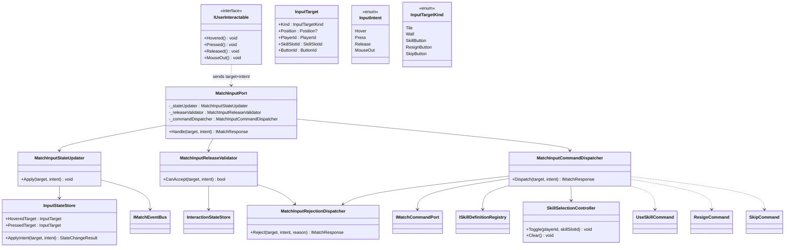
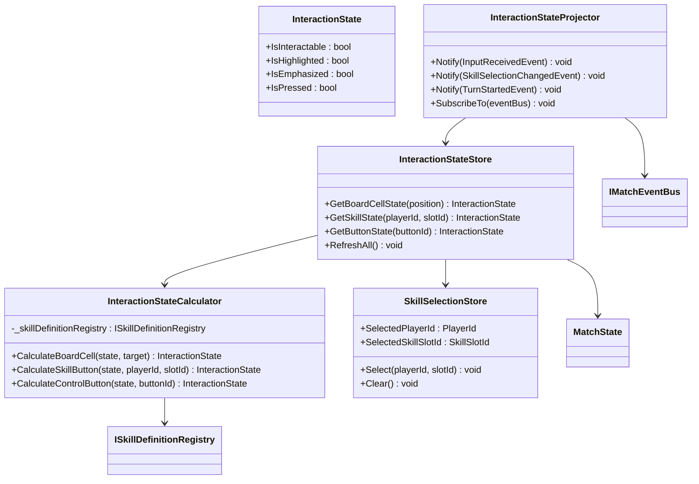
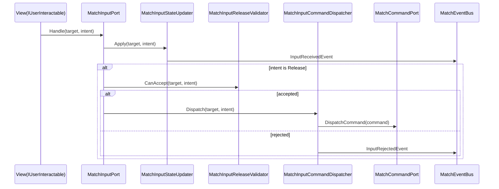

# Input / Interaction Flow

## 入力系クラス図

## Interaction State クラス図

## シーケンス

## Release 時の変換

| Target | 変換 |
|---|---|
| Tile / Wall | 選択中スキルがあればその `SkillSlotId`、なければ通常移動/通常壁設置の `UseSkillCommand` |
| SkillButton | 対象なし即時スキルなら `UseSkillCommand`、対象指定スキルなら `SkillSelectionController.Toggle` |
| ResignButton | `ResignCommand` |
| SkipButton | `SkipCommand` |
