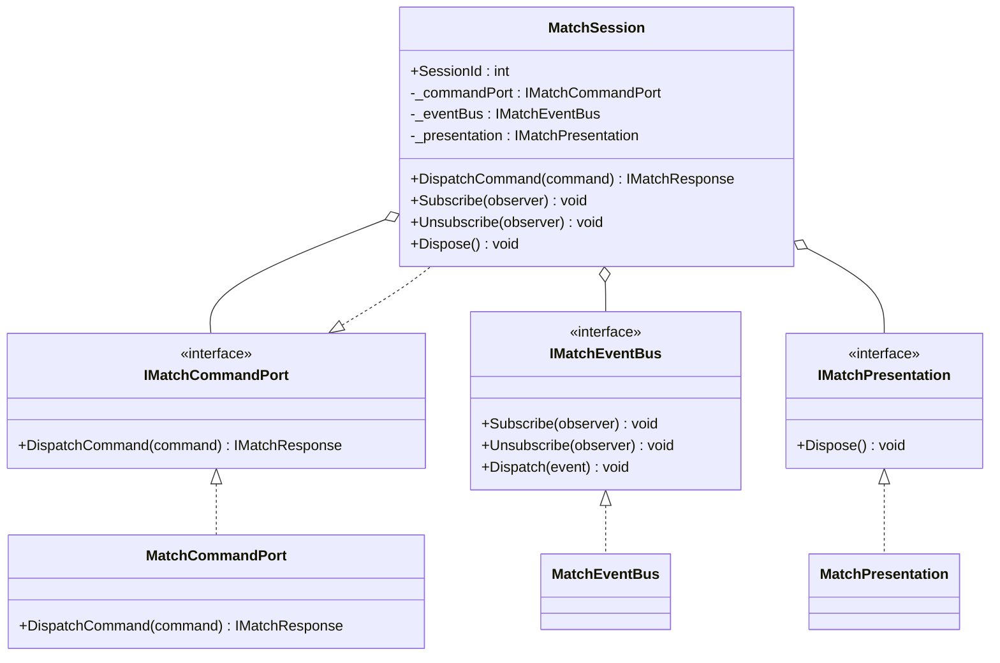
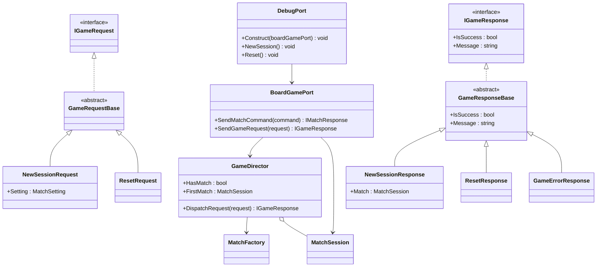
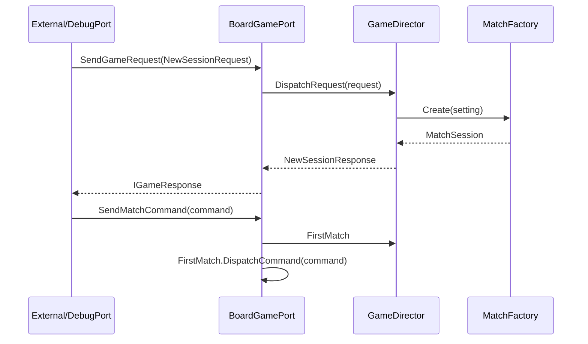

# Match Session / GameFlow

## MatchSession クラス図

```mermaid
classDiagram
    class MatchSession{
        +SessionId : int
        -_commandPort : IMatchCommandPort
        -_eventBus : IMatchEventBus
        -_presentation : IMatchPresentation
        +DispatchCommand(command) IMatchResponse
        +Subscribe(observer) void
        +Unsubscribe(observer) void
        +Dispose() void
    }

    class IMatchCommandPort{
        <<interface>>
        +DispatchCommand(command) IMatchResponse
    }

    class IMatchEventBus{
        <<interface>>
        +Subscribe(observer) void
        +Unsubscribe(observer) void
        +Dispatch(event) void
    }

    class IMatchPresentation{
        <<interface>>
        +Dispose() void
    }

    class MatchCommandPort{
        +DispatchCommand(command) IMatchResponse
    }

    class MatchEventBus
    class MatchPresentation

    IMatchCommandPort <|.. MatchSession
    MatchSession o-- IMatchCommandPort
    MatchSession o-- IMatchEventBus
    MatchSession o-- IMatchPresentation
    IMatchCommandPort <|.. MatchCommandPort
    IMatchEventBus <|.. MatchEventBus
    IMatchPresentation <|.. MatchPresentation
```

## GameFlow クラス図

```mermaid
classDiagram
    class GameDirector{
        +HasMatch : bool
        +FirstMatch : MatchSession
        +DispatchRequest(request) IGameResponse
    }

    class BoardGamePort{
        +SendMatchCommand(command) IMatchResponse
        +SendGameRequest(request) IGameResponse
    }

    class DebugPort{
        +Construct(boardGamePort) void
        +NewSession() void
        +Reset() void
    }

    class IGameRequest{
        <<interface>>
    }

    class GameRequestBase{
        <<abstract>>
    }
    IGameRequest <|.. GameRequestBase

    class NewSessionRequest{
        +Setting : MatchSetting
    }
    class ResetRequest
    GameRequestBase <|-- NewSessionRequest
    GameRequestBase <|-- ResetRequest

    class IGameResponse{
        <<interface>>
        +IsSuccess : bool
        +Message : string
    }

    class GameResponseBase{
        <<abstract>>
        +IsSuccess : bool
        +Message : string
    }
    IGameResponse <|.. GameResponseBase

    class NewSessionResponse{
        +Match : MatchSession
    }
    class ResetResponse
    class GameErrorResponse
    GameResponseBase <|-- NewSessionResponse
    GameResponseBase <|-- ResetResponse
    GameResponseBase <|-- GameErrorResponse

    GameDirector --> MatchFactory
    GameDirector o-- MatchSession
    BoardGamePort --> GameDirector
    BoardGamePort --> MatchSession
    DebugPort --> BoardGamePort
```

## Game Request フロー

```mermaid
sequenceDiagram
    participant External as External/DebugPort
    participant Port as BoardGamePort
    participant Director as GameDirector
    participant Factory as MatchFactory

    External->>Port: SendGameRequest(NewSessionRequest)
    Port->>Director: DispatchRequest(request)
    Director->>Factory: Create(setting)
    Factory-->>Director: MatchSession
    Director-->>Port: NewSessionResponse
    Port-->>External: IGameResponse

    External->>Port: SendMatchCommand(command)
    Port->>Director: FirstMatch
    Port->>Port: FirstMatch.DispatchCommand(command)
```
