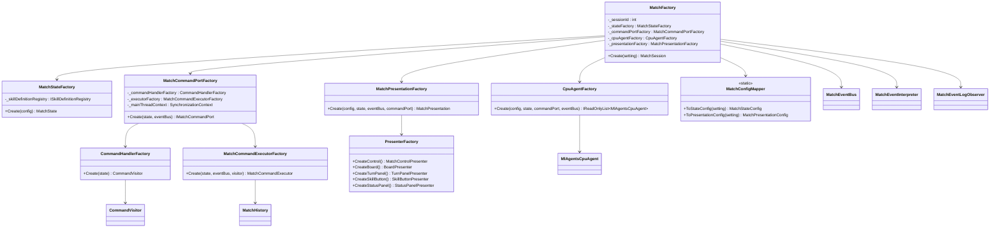
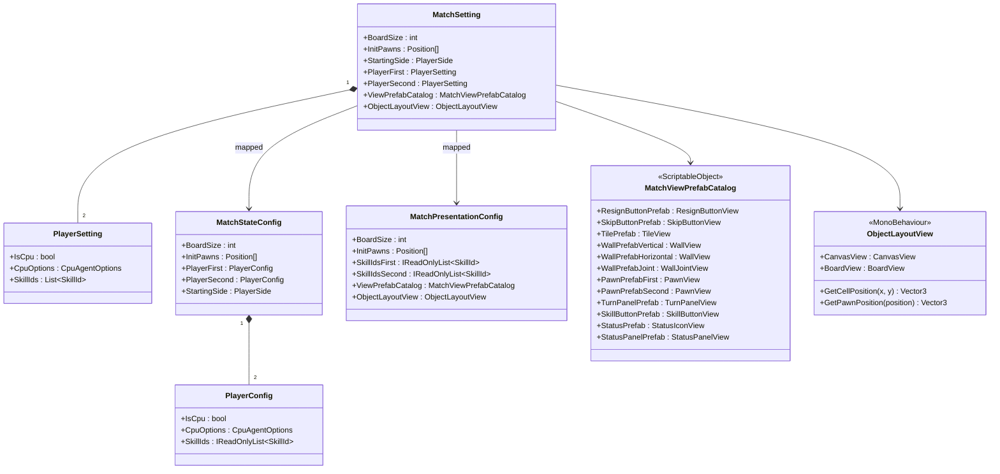
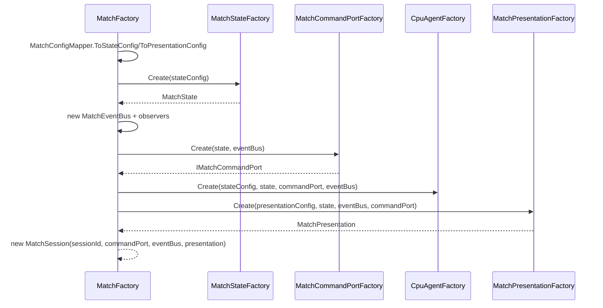

# Match Factory / Composition Root

## Factory クラス図

```mermaid
classDiagram
    class MatchFactory{
        -_sessionId : int
        -_stateFactory : MatchStateFactory
        -_commandPortFactory : MatchCommandPortFactory
        -_cpuAgentFactory : CpuAgentFactory
        -_presentationFactory : MatchPresentationFactory
        +Create(setting) MatchSession
    }

    class MatchStateFactory{
        -_skillDefinitionRegistry : ISkillDefinitionRegistry
        +Create(config) MatchState
    }

    class MatchCommandPortFactory{
        -_commandHandlerFactory : CommandHandlerFactory
        -_executorFactory : MatchCommandExecutorFactory
        -_mainThreadContext : SynchronizationContext
        +Create(state, eventBus) IMatchCommandPort
    }

    class CommandHandlerFactory{
        +Create(state) CommandVisitor
    }

    class MatchCommandExecutorFactory{
        +Create(state, eventBus, visitor) MatchCommandExecutor
    }

    class MatchPresentationFactory{
        +Create(config, state, eventBus, commandPort) MatchPresentation
    }

    class PresenterFactory{
        +CreateControl() MatchControlPresenter
        +CreateBoard() BoardPresenter
        +CreateTurnPanel() TurnPanelPresenter
        +CreateSkillButton() SkillButtonPresenter
        +CreateStatusPanel() StatusPanelPresenter
    }

    class CpuAgentFactory{
        +Create(config, state, commandPort, eventBus) IReadOnlyList~MlAgentsCpuAgent~
    }

    class MatchConfigMapper{
        <<static>>
        +ToStateConfig(setting) MatchStateConfig
        +ToPresentationConfig(setting) MatchPresentationConfig
    }

    MatchFactory --> MatchConfigMapper
    MatchFactory --> MatchStateFactory
    MatchFactory --> MatchCommandPortFactory
    MatchFactory --> CpuAgentFactory
    MatchFactory --> MatchPresentationFactory
    MatchFactory --> MatchEventBus
    MatchFactory --> MatchEventInterpreter
    MatchFactory --> MatchEventLogObserver
    MatchCommandPortFactory --> CommandHandlerFactory
    MatchCommandPortFactory --> MatchCommandExecutorFactory
    CommandHandlerFactory --> CommandVisitor
    MatchCommandExecutorFactory --> MatchHistory
    MatchPresentationFactory --> PresenterFactory
    CpuAgentFactory --> MlAgentsCpuAgent
```

## 設定クラス図

```mermaid
classDiagram
    class MatchSetting{
        +BoardSize : int
        +InitPawns : Position[]
        +StartingSide : PlayerSide
        +PlayerFirst : PlayerSetting
        +PlayerSecond : PlayerSetting
        +ViewPrefabCatalog : MatchViewPrefabCatalog
        +ObjectLayoutView : ObjectLayoutView
    }

    class PlayerSetting{
        +IsCpu : bool
        +CpuOptions : CpuAgentOptions
        +SkillIds : List~SkillId~
    }

    class MatchStateConfig{
        +BoardSize : int
        +InitPawns : Position[]
        +PlayerFirst : PlayerConfig
        +PlayerSecond : PlayerConfig
        +StartingSide : PlayerSide
    }

    class PlayerConfig{
        +IsCpu : bool
        +CpuOptions : CpuAgentOptions
        +SkillIds : IReadOnlyList~SkillId~
    }

    class MatchPresentationConfig{
        +BoardSize : int
        +InitPawns : Position[]
        +SkillIdsFirst : IReadOnlyList~SkillId~
        +SkillIdsSecond : IReadOnlyList~SkillId~
        +ViewPrefabCatalog : MatchViewPrefabCatalog
        +ObjectLayoutView : ObjectLayoutView
    }

    class MatchViewPrefabCatalog{
        <<ScriptableObject>>
        +ResignButtonPrefab : ResignButtonView
        +SkipButtonPrefab : SkipButtonView
        +TilePrefab : TileView
        +WallPrefabVertical : WallView
        +WallPrefabHorizontal : WallView
        +WallPrefabJoint : WallJointView
        +PawnPrefabFirst : PawnView
        +PawnPrefabSecond : PawnView
        +TurnPanelPrefab : TurnPanelView
        +SkillButtonPrefab : SkillButtonView
        +StatusPrefab : StatusIconView
        +StatusPanelPrefab : StatusPanelView
    }

    class ObjectLayoutView{
        <<MonoBehaviour>>
        +CanvasView : CanvasView
        +BoardView : BoardView
        +GetCellPosition(x, y) Vector3
        +GetPawnPosition(position) Vector3
    }

    MatchSetting "1" *-- "2" PlayerSetting
    MatchStateConfig "1" *-- "2" PlayerConfig
    MatchSetting --> MatchStateConfig : mapped
    MatchSetting --> MatchPresentationConfig : mapped
    MatchSetting --> MatchViewPrefabCatalog
    MatchSetting --> ObjectLayoutView
```

## Composition フロー

```mermaid
sequenceDiagram
    participant Factory as MatchFactory
    participant StateFactory as MatchStateFactory
    participant CommandFactory as MatchCommandPortFactory
    participant CpuFactory as CpuAgentFactory
    participant PresentationFactory as MatchPresentationFactory

    Factory->>Factory: MatchConfigMapper.ToStateConfig/ToPresentationConfig
    Factory->>StateFactory: Create(stateConfig)
    StateFactory-->>Factory: MatchState
    Factory->>Factory: new MatchEventBus + observers
    Factory->>CommandFactory: Create(state, eventBus)
    CommandFactory-->>Factory: IMatchCommandPort
    Factory->>CpuFactory: Create(stateConfig, state, commandPort, eventBus)
    Factory->>PresentationFactory: Create(presentationConfig, state, eventBus, commandPort)
    PresentationFactory-->>Factory: MatchPresentation
    Factory-->>Factory: new MatchSession(sessionId, commandPort, eventBus, presentation)
```
