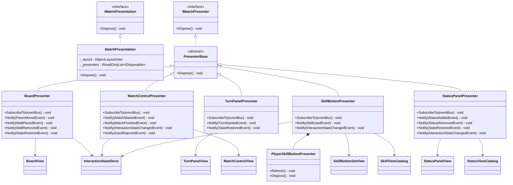
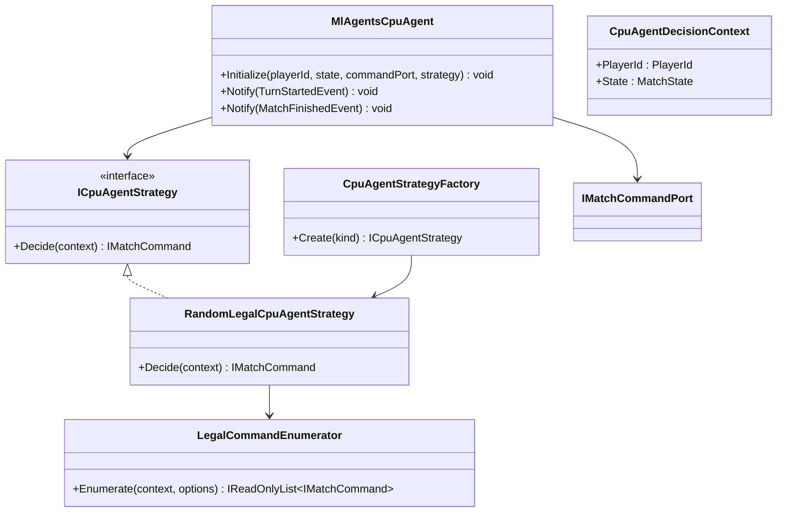

# Presentation / Presenter / View

## Presenter クラス図

```mermaid
classDiagram
    class IMatchPresentation{
        <<interface>>
        +Dispose() void
    }

    class MatchPresentation{
        -_layout : ObjectLayoutView
        -_presenters : IReadOnlyList~IDisposable~
        +Dispose() void
    }
    IMatchPresentation <|.. MatchPresentation

    class IMatchPresenter{
        <<interface>>
        +Dispose() void
    }

    class PresenterBase{
        <<abstract>>
        +Dispose() void
    }
    IMatchPresenter <|.. PresenterBase

    class BoardPresenter{
        +SubscribeTo(eventBus) void
        +Notify(PawnMovedEvent) void
        +Notify(WallPlacedEvent) void
        +Notify(WallRemovedEvent) void
        +Notify(StateRestoredEvent) void
    }

    class TurnPanelPresenter{
        +SubscribeTo(eventBus) void
        +Notify(TurnStartedEvent) void
        +Notify(StateRestoredEvent) void
    }

    class MatchControlPresenter{
        +SubscribeTo(eventBus) void
        +Notify(MatchStartedEvent) void
        +Notify(MatchFinishedEvent) void
        +Notify(InteractionStateChangedEvent) void
        +Notify(InputRejectedEvent) void
    }

    class SkillButtonPresenter{
        +SubscribeTo(eventBus) void
        +Notify(SkillUsedEvent) void
        +Notify(InteractionStateChangedEvent) void
    }

    class PlayerSkillButtonPresenter{
        +Refresh() void
        +Dispose() void
    }

    class StatusPanelPresenter{
        +SubscribeTo(eventBus) void
        +Notify(StatusAddedEvent) void
        +Notify(StatusRemovedEvent) void
        +Notify(StateRestoredEvent) void
        +Notify(InteractionStateChangedEvent) void
    }

    PresenterBase <|-- BoardPresenter
    PresenterBase <|-- TurnPanelPresenter
    PresenterBase <|-- MatchControlPresenter
    PresenterBase <|-- SkillButtonPresenter
    PresenterBase <|-- StatusPanelPresenter
    SkillButtonPresenter *-- PlayerSkillButtonPresenter
    BoardPresenter --> BoardView
    TurnPanelPresenter --> TurnPanelView
    MatchControlPresenter --> MatchControlView
    SkillButtonPresenter --> SkillButtonSetView
    StatusPanelPresenter --> StatusPanelView
    BoardPresenter --> InteractionStateStore
    MatchControlPresenter --> InteractionStateStore
    SkillButtonPresenter --> InteractionStateStore
    StatusPanelPresenter --> StatusViewCatalog
    SkillButtonPresenter --> SkillViewCatalog
```

## ViewModel / View クラス図

```mermaid
classDiagram
    class ViewModelBase

    class BoardCellViewModel{
        +Position : Position
        +HasWall : bool
        +PawnPlayerId : PlayerId
        +Interaction : InteractionState
    }
    ViewModelBase <|-- BoardCellViewModel

    class ButtonViewModel{
        +Interaction : InteractionState
    }
    ViewModelBase <|-- ButtonViewModel

    class SkillButtonViewModel{
        +PlayerId : PlayerId
        +SkillSlotId : SkillSlotId
        +SkillId : SkillId
        +RemainingUses : int?
    }
    ButtonViewModel <|-- SkillButtonViewModel

    class StatusPanelViewModel{
        +PlayerId : PlayerId
        +Statuses : IReadOnlyList~StatusState~
    }

    class ViewBase{
        <<MonoBehaviour>>
        +Show() void
        +Hide() void
        +PlayShow() void
        +PlayHide() void
    }

    class BoardCellViewModelViewBase{
        +BindViewModel(viewModel) void
    }
    ViewBase <|-- BoardCellViewModelViewBase

    class BoardCellViewBase{
        +BindInputPort(inputPort) void
        +SetPosition(position) void
        +Hovered() void
        +Pressed() void
        +Released() void
        +MouseOut() void
    }
    BoardCellViewModelViewBase <|-- BoardCellViewBase
    IUserInteractable <|.. BoardCellViewBase

    class TileView{
        +Highlight() void
        +Emphasize() void
        +Dim() void
        +Press() void
        +Clear() void
        +PlayInvalidFeedback() void
    }
    BoardCellViewBase <|-- TileView

    class WallView{
        +PlaceWall() void
        +RemoveWall() void
        +Highlight() void
        +Emphasize() void
        +Dim() void
        +Press() void
    }
    BoardCellViewBase <|-- WallView

    class WallJointView{
        +Highlight() void
        +Emphasize() void
        +Dim() void
        +Clear() void
    }
    BoardCellViewModelViewBase <|-- WallJointView

    class CanvasButtonViewBase{
        +BindInputPort(inputPort) void
        +BindViewModel(viewModel) void
        +OnPointerEnter(eventData) void
        +OnPointerDown(eventData) void
        +OnPointerUp(eventData) void
        +OnPointerExit(eventData) void
    }
    ViewBase <|-- CanvasButtonViewBase
    IUserInteractable <|.. CanvasButtonViewBase

    class ResignButtonView
    class SkipButtonView
    CanvasButtonViewBase <|-- ResignButtonView
    CanvasButtonViewBase <|-- SkipButtonView

    class SkillButtonView{
        +ViewModel : SkillButtonViewModel
        +Initialize(playerId, slotId) void
        +BindViewDefinition(entry) void
        +BindInputPort(inputPort) void
        +BindViewModel(viewModel) void
    }
    ViewBase <|-- SkillButtonView
    IUserInteractable <|.. SkillButtonView

    class StatusPanelView{
        +ViewModel : StatusPanelViewModel
        +BindViewModel(viewModel) void
        +AddStatusIcon(statusId) void
        +RemoveStatusIcon(statusId) void
    }
    ViewBase <|-- StatusPanelView

    class StatusIconView{
        +BindViewDefinition(entry) void
        +PlayShow() void
        +PlayHide() void
        +ShowDescription() void
        +HideDescription() void
    }
    ViewBase <|-- StatusIconView

    class BoardView
    class PawnView{
        +Move(position) void
    }
    class TurnPanelView{
        +UpdateTurnCount(turn) void
        +SetLabel(text) void
    }
    class MatchControlView
    class SkillButtonSetView
    class CanvasView
    ViewBase <|-- BoardView
    ViewBase <|-- PawnView
    ViewBase <|-- TurnPanelView
    ViewBase <|-- MatchControlView
    ViewBase <|-- SkillButtonSetView
    ViewBase <|-- CanvasView
```

## CPU Agent クラス図

```mermaid
classDiagram
    class MlAgentsCpuAgent{
        +Initialize(playerId, state, commandPort, strategy) void
        +Notify(TurnStartedEvent) void
        +Notify(MatchFinishedEvent) void
    }

    class ICpuAgentStrategy{
        <<interface>>
        +Decide(context) IMatchCommand
    }

    class RandomLegalCpuAgentStrategy{
        +Decide(context) IMatchCommand
    }
    ICpuAgentStrategy <|.. RandomLegalCpuAgentStrategy

    class CpuAgentStrategyFactory{
        +Create(kind) ICpuAgentStrategy
    }

    class LegalCommandEnumerator{
        +Enumerate(context, options) IReadOnlyList~IMatchCommand~
    }

    class CpuAgentDecisionContext{
        +PlayerId : PlayerId
        +State : MatchState
    }

    MlAgentsCpuAgent --> IMatchCommandPort
    MlAgentsCpuAgent --> ICpuAgentStrategy
    RandomLegalCpuAgentStrategy --> LegalCommandEnumerator
    CpuAgentStrategyFactory --> RandomLegalCpuAgentStrategy
```
