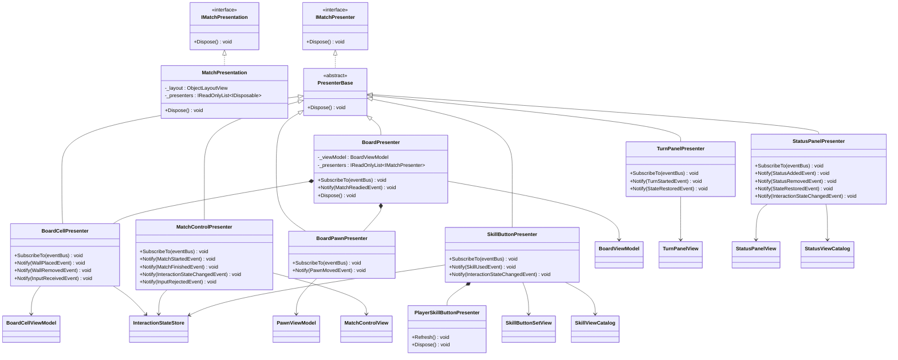
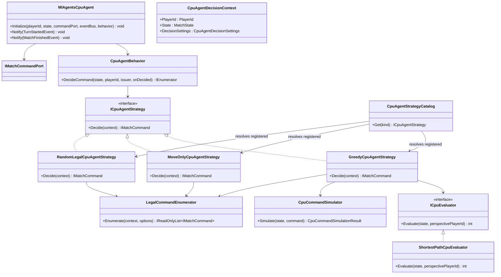
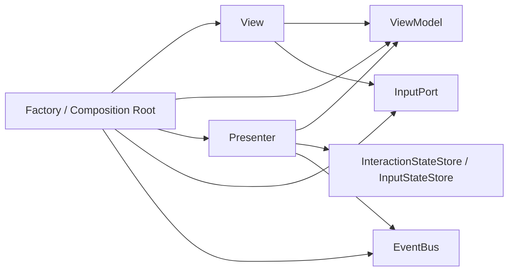

# Presentation / Presenter / View

## Presenter クラス図

## ViewModel / View クラス図

```mermaid
classDiagram
    class ViewModelBase

    class BoardViewModel{
        +IsVisible : bool
    }
    ViewModelBase <|-- BoardViewModel

    class BoardCellViewModel{
        +IsBuilt : bool
    }
    ViewModelBase <|-- BoardCellViewModel

    class PawnViewModel{
        +Position : Position
    }
    ViewModelBase <|-- PawnViewModel

    class ButtonViewModel{
        +Interaction : InteractionState
    }
    ViewModelBase <|-- ButtonViewModel

    class SkillButtonViewModel{
        +PlayerId : PlayerId
        +SkillSlotId : SkillSlotId
        +SkillId : SkillId
        +RemainingUses : int?
    }
    ButtonViewModel <|-- SkillButtonViewModel

    class StatusPanelViewModel{
        +PlayerId : PlayerId
        +Statuses : IReadOnlyList~StatusState~
    }

    class ViewBase{
        <<MonoBehaviour>>
        +Show() void
        +Hide() void
        +PlayShow() void
        +PlayHide() void
    }

    class BoardCellViewModelViewBase{
        +BindViewModel(viewModel) void
    }
    ViewBase <|-- BoardCellViewModelViewBase

    class BoardCellViewBase{
        +BindInputPort(inputPort) void
        +SetPosition(position) void
        +Hovered() void
        +Pressed() void
        +Released() void
        +MouseOut() void
    }
    BoardCellViewModelViewBase <|-- BoardCellViewBase
    IUserInteractable <|.. BoardCellViewBase

    class TileView{
        +Highlight() void
        +Emphasize() void
        +Dim() void
        +Press() void
        +Clear() void
        +PlayInvalidFeedback() void
    }
    BoardCellViewBase <|-- TileView

    class WallView{
        +PlaceWall() void
        +RemoveWall() void
        +Highlight() void
        +Emphasize() void
        +Dim() void
        +Press() void
    }
    BoardCellViewBase <|-- WallView

    class WallJointView{
        +Highlight() void
        +Emphasize() void
        +Dim() void
        +Clear() void
    }
    BoardCellViewModelViewBase <|-- WallJointView

    class CanvasButtonViewBase{
        +BindInputPort(inputPort) void
        +BindViewModel(viewModel) void
        +OnPointerEnter(eventData) void
        +OnPointerDown(eventData) void
        +OnPointerUp(eventData) void
        +OnPointerExit(eventData) void
    }
    ViewBase <|-- CanvasButtonViewBase
    IUserInteractable <|.. CanvasButtonViewBase

    class ResignButtonView
    class SkipButtonView
    CanvasButtonViewBase <|-- ResignButtonView
    CanvasButtonViewBase <|-- SkipButtonView

    class SkillButtonView{
        +ViewModel : SkillButtonViewModel
        +Initialize(playerId, slotId) void
        +BindViewDefinition(entry) void
        +BindInputPort(inputPort) void
        +BindViewModel(viewModel) void
    }
    ViewBase <|-- SkillButtonView
    IUserInteractable <|.. SkillButtonView

    class StatusPanelView{
        +ViewModel : StatusPanelViewModel
        +BindViewModel(viewModel) void
        +AddStatusIcon(statusId) void
        +RemoveStatusIcon(statusId) void
    }
    ViewBase <|-- StatusPanelView

    class StatusIconView{
        +BindViewDefinition(entry) void
        +PlayShow() void
        +PlayHide() void
        +ShowDescription() void
        +HideDescription() void
    }
    ViewBase <|-- StatusIconView

    class BoardView{
        +BindViewModel(viewModel) void
    }
    class PawnView{
        +BindPositionResolver(positionResolver) void
        +BindViewModel(viewModel) void
    }
    class TurnPanelView{
        +UpdateTurnCount(turn) void
        +SetLabel(text) void
    }
    class MatchControlView
    class SkillButtonSetView
    class CanvasView
    ViewBase <|-- BoardView
    ViewBase <|-- PawnView
    ViewBase <|-- TurnPanelView
    ViewBase <|-- MatchControlView
    ViewBase <|-- SkillButtonSetView
    ViewBase <|-- CanvasView
```

## CPU Agent クラス図

## Presenter 周りの修正方針

### 目的

Presenter / View / ViewModel / Factory の責務を明確化し、画面要素ごとに異なる組み立て方を統一する。
現状は以下のように責務が混在しているため、段階的に整理する。

- Factory が ViewModel を生成して View に Bind する箇所がある。
- Presenter が ViewModel を生成して View に Bind する箇所がある。
- Presenter が View を直接保持し、表示更新・破棄まで行う箇所がある。
- ViewModel を使わず、Presenter が View のメソッドを直接呼ぶ箇所がある。

### 基本方針

#### Factory

Factory は Presentation 層の Composition Root として、生成と配線を担当する。

- Prefab から View を生成する。
- ViewModel を生成する。
- View と ViewModel を Bind する。
- View と InputPort を Bind する。
- Presenter を生成する。
- Presenter を EventBus に Subscribe する。

`BindViewModel` や `BindInputPort` は原則 Factory で完了させ、Presenter の constructor では行わない。

#### Presenter

Presenter は Match の状態やイベントを ViewModel に投影する役割に寄せる。

- EventBus の購読・購読解除を行う。
- MatchEvent / Store / State を読み取り、ViewModel を更新する。
- ViewModel の生成・Bind は行わない。
- 原則として concrete View を保持しない。
- `Dispose` では原則 EventBus の unsubscribe のみ行う。

Presenter が View を直接持つ必要がある場合は、以下のような例外に限定する。

- 動的 View の追加・削除を扱う暫定実装。
- 一回きりの演出・フィードバックを扱う暫定実装。
- ViewModel 化するよりも明らかに単純で、将来的な置換範囲が限定されている処理。

ただし、その場合も concrete View ではなく、用途を絞った interface に切り出せるかを優先して検討する。

#### ViewModel

ViewModel は View に表示させる状態だけを持つ Unity 非依存のオブジェクトにする。

- Unity API に依存しない。
- `MonoBehaviour` を継承しない。
- Domain Model や MatchState を直接操作しない。
- 表示状態を property として持つ。
- 変更通知 API は可能な限り `Changed` に統一する。

#### View

View は Unity 側の見た目と入力イベントの入口に限定する。

- `SerializeField`、Prefab、Unity Component への参照を持つ。
- ViewModel を購読し、変更を見た目へ反映する。
- PointerEvent など Unity 入力を InputPort に流す。
- EventBus や MatchState を知らない。
- ゲームルールや InteractionState の算出を行わない。

### 推奨する依存方向

Presenter から View への依存は原則なくす。
ViewModel から View / Presenter / EventBus / Unity API への依存も持たせない。

### 段階的な修正順

#### 1. Bind 責務を Factory に統一する

最優先で、ViewModel の生成と View への Bind を Presenter から Factory へ移す。

対象候補:

- `StatusPanelPresenter`
  - `StatusPanelViewModel` の生成を Factory に移す。
  - `StatusPanelView.BindViewModel` の呼び出しを Factory に移す。
  - Presenter は `StatusPanelViewModel` を受け取り、値の更新だけ行う。
- `PlayerSkillButtonPresenter`
  - `SkillButtonViewModel` の生成を Factory に移す。
  - `SkillButtonView.BindViewModel` の呼び出しを Factory に移す。
  - Presenter は `SkillButtonViewModel[]` を受け取り、値の更新だけ行う。

#### 2. Presenter から未使用 View 参照を削除する

Presenter が保持しているが実際には使っていない View 参照を削除する。

対象候補:

- `MatchControlPresenter`
  - button View 配列は Presenter 内で使わない場合、constructor 引数と field から削除する。
  - Presenter は `ButtonViewModel[]` と Store だけを持つ。

#### 3. View 直接更新を ViewModel 更新へ寄せる

ViewModel を使わず Presenter が View を直接更新している UI を、ViewModel 経由へ移行する。

対象候補:

- `TurnPanelPresenter`
  - `TurnPanelViewModel` を追加する。
  - `CurrentTurn`、`IsVisible`、必要なら `Label` を ViewModel に持たせる。
  - `TurnPanelView` は `BindViewModel` し、ViewModel の変更を Text / 表示状態へ反映する。
  - Presenter は `TurnPanelViewModel` だけを更新する。

#### 4. 動的 View 管理を抽象化する

動的に生成・削除される View は、いきなり完全な MVVM 化を目指さず、まずは責務を明確化する。

対象候補:

- `StatusPanelPresenter` の StatusIcon 管理
  - 短期: `IStatusIconContainer` や `IStatusIconViewFactory` のような用途限定 interface を導入する。
  - 長期: StatusIcon 用 ViewModel collection を作り、View 側が差分を描画する。

#### 5. Board / Pawn の View 直接操作を分割する

Board は影響範囲が大きいため最後に整理する。

対象候補:

- `BoardPresenter`
  - BoardCell の状態更新と Pawn 移動を分ける。
  - 壁・セルの hover / press / built 状態は `BoardCellViewModel` 更新に寄せる。
  - Pawn 移動は将来的に `PawnViewModel` を導入し、Presenter が View を直接動かさない形へ寄せる。

#### 6. View の破棄責務を整理する

Presenter の `Dispose` から Unity Object の `Destroy` を外し、破棄責務を lifecycle owner に寄せる。

- Presenter は EventBus の unsubscribe を担当する。
- `MatchObjects` または専用の Presentation lifecycle owner が root View を Destroy する。
- root を Destroy すれば子 View も破棄される構造にする。

### 完了条件

以下を満たす状態を目標とする。

- ViewModel 生成と View への Bind は Factory に集約されている。
- Presenter は原則 ViewModel と Store だけを持つ。
- Presenter は View の表示メソッドを直接呼ばず、ViewModel を更新する。
- View は ViewModel の変更を見た目へ反映するだけになっている。
- InputPort の Bind は Factory に集約されている。
- ViewModel の変更通知 API が統一されている。
- Presenter の `Dispose` は購読解除中心になっている。
- Unity Object の Destroy は `MatchObjects` など lifecycle owner に集約されている。

### 注意点

- 一度に全 Presenter を直さない。
- まずは Bind 責務の統一から始める。
- Board / Pawn は影響範囲が大きいため、最後に小さく分割して移行する。
- 動的 View は短期的には interface 抽象化、長期的には ViewModel collection 化を検討する。
- 一回きり演出は ViewModel の状態と混ぜず、必要に応じて feedback 用 interface やイベントで扱う。
