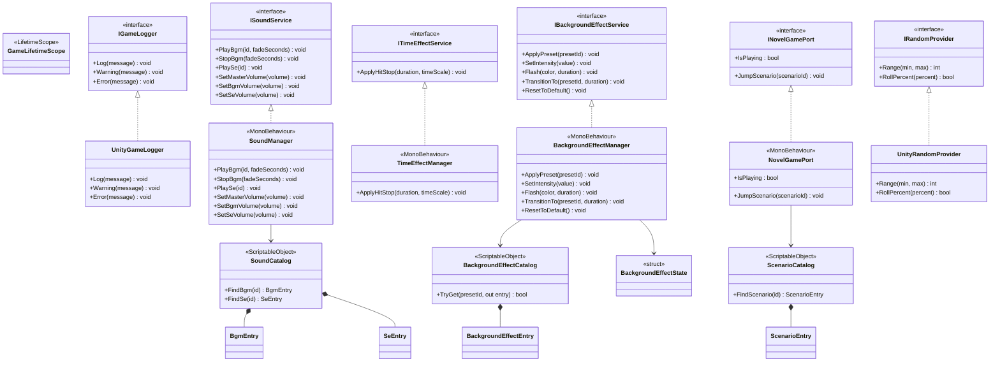
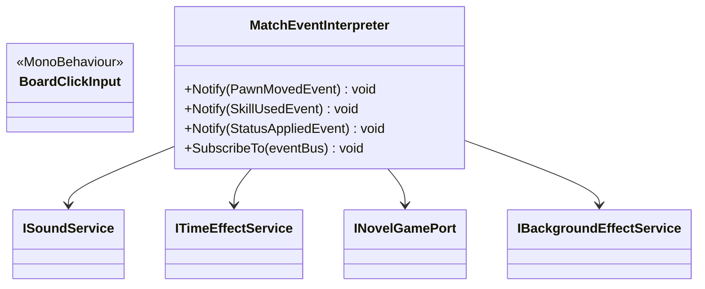

# UnityIntegration / Services

## Unity サービス クラス図

## Board / Novel 連携補助

## 補足

- 旧ドキュメントの `Instance` ベース Singleton 表記ではなく、現行コードは VContainer の `GameLifetimeScope` とインターフェース注入を中心に組み立てます。
- `SoundManager`、`BackgroundEffectManager`、`TimeEffectManager`、`NovelGamePort` は MonoBehaviour 実装ですが、Application 層からは各インターフェース経由で参照されます。
