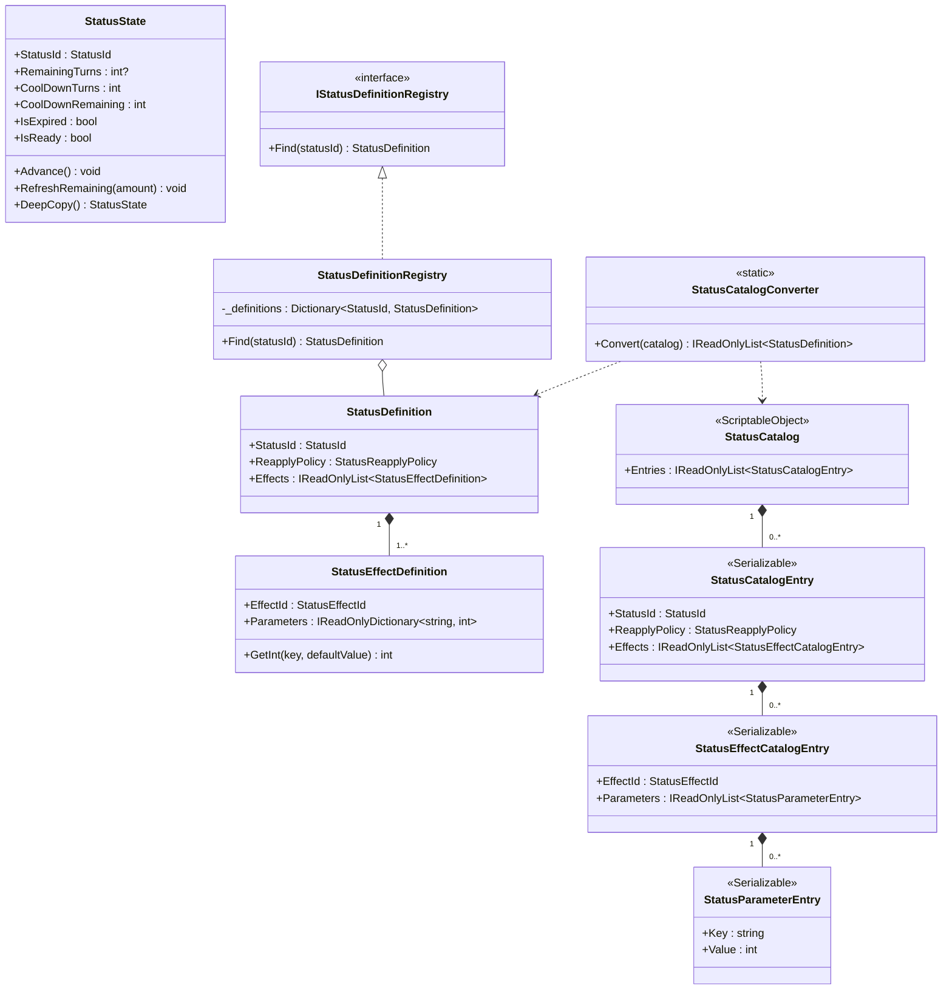
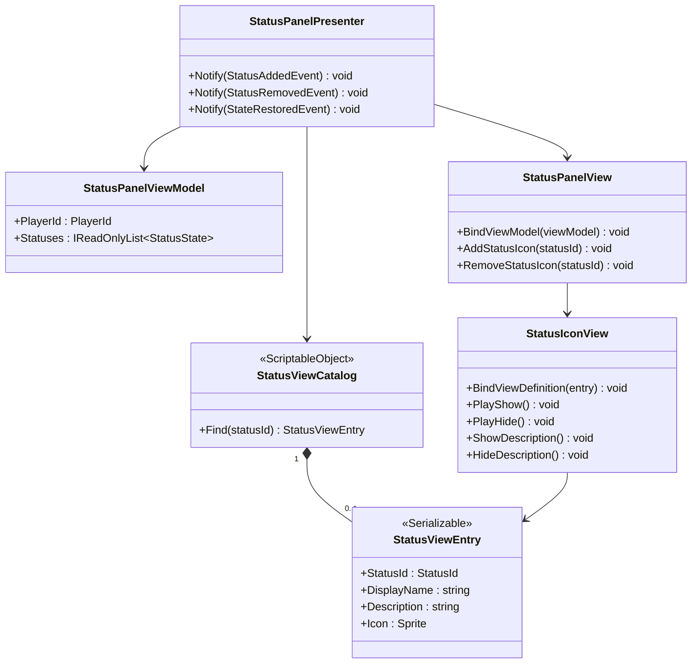
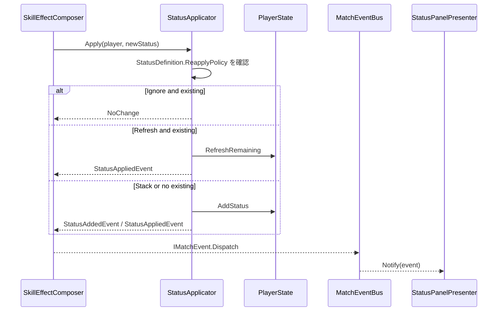
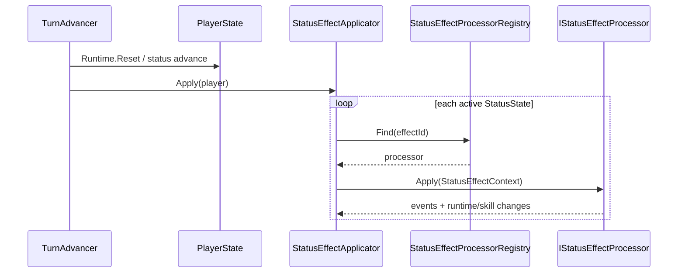

# Status システム

## Status クラス図

## Status 適用 / Processor クラス図

```mermaid
classDiagram
    class StatusApplicator{
        -_statusDefinitionRegistry : IStatusDefinitionRegistry
        +Apply(player, newStatus) StateChangeResult
    }

    class StatusEffectApplicator{
        -_definitionRegistry : IStatusDefinitionRegistry
        -_processorRegistry : IStatusEffectProcessorRegistry
        +Apply(player) IReadOnlyList~IMatchEvent~
    }

    class IStatusEffectProcessor{
        <<interface>>
        +EffectId : StatusEffectId
        +Apply(context) IReadOnlyList~IMatchEvent~
    }

    class IStatusEffectProcessorRegistry{
        <<interface>>
        +Find(effectId) IStatusEffectProcessor
    }

    class StatusEffectProcessorRegistry{
        -_processors : Dictionary~StatusEffectId, IStatusEffectProcessor~
        +Find(effectId) IStatusEffectProcessor
    }
    IStatusEffectProcessorRegistry <|.. StatusEffectProcessorRegistry

    class StatusEffectContext{
        +PlayerId : PlayerId
        +Player : PlayerState
        +StatusId : StatusId
        +Effect : StatusEffectDefinition
    }

    class CannotActStatusEffectProcessor
    class CannotMovePawnStatusEffectProcessor
    class CannotPlaceWallStatusEffectProcessor
    class CannotUseSpecialSkillStatusEffectProcessor
    class ProbabilisticCannotActStatusEffectProcessor
    class RecoveryWallStatusEffectProcessor
    class DamageWallStatusEffectProcessor

    IStatusEffectProcessor <|.. CannotActStatusEffectProcessor
    IStatusEffectProcessor <|.. CannotMovePawnStatusEffectProcessor
    IStatusEffectProcessor <|.. CannotPlaceWallStatusEffectProcessor
    IStatusEffectProcessor <|.. CannotUseSpecialSkillStatusEffectProcessor
    IStatusEffectProcessor <|.. ProbabilisticCannotActStatusEffectProcessor
    IStatusEffectProcessor <|.. RecoveryWallStatusEffectProcessor
    IStatusEffectProcessor <|.. DamageWallStatusEffectProcessor

    StatusApplicator --> IStatusDefinitionRegistry
    StatusEffectApplicator --> IStatusDefinitionRegistry
    StatusEffectApplicator --> IStatusEffectProcessorRegistry
    IStatusEffectProcessor ..> StatusEffectContext
    StatusEffectContext --> PlayerState
    StatusEffectContext --> StatusEffectDefinition
```

## Status View クラス図

## ReapplyPolicy フロー

## ターン開始時の適用フロー

## Status / Effect 一覧

| Enum | 値 |
|---|---|
| `StatusId` | Sleep, Paralysis, SealMovePawn, SealPlaceWall, SealSpecialSkill, RecoveryWall, DamageWall |
| `StatusEffectId` | CannotAct, ProbabilisticCannotAct, CannotMovePawn, CannotPlaceWall, CannotUseSpecialSkill, RecoveryWall, DamageWall |
| `StatusReapplyPolicy` | Ignore, Refresh, Stack |
