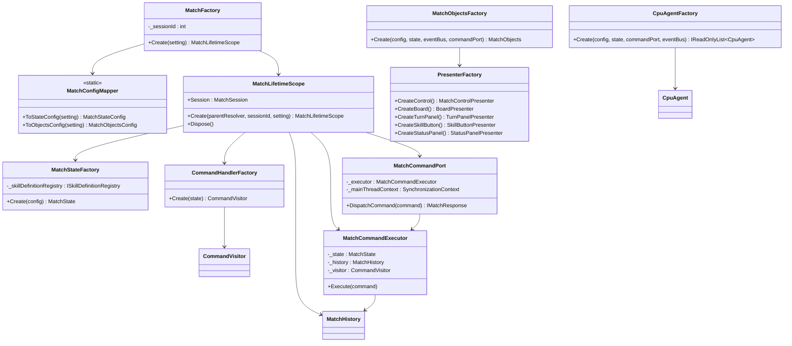
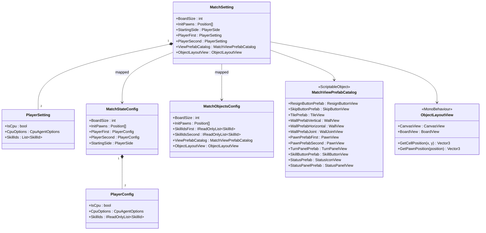
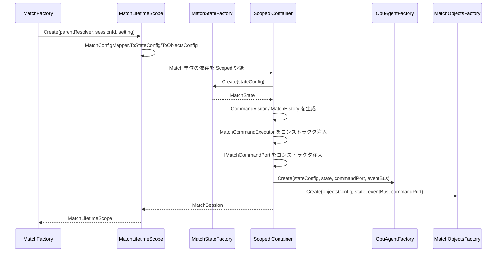

# Match Scope / Composition Root

## Composition Root クラス図

```mermaid
classDiagram
    class MatchFactory{
        -_sessionId : int
        +Create(setting) MatchLifetimeScope
    }

    class MatchLifetimeScope{
        +Session : MatchSession
        +Create(parentResolver, sessionId, setting) MatchLifetimeScope
        +Dispose()
    }

    class MatchStateFactory{
        -_skillDefinitionRegistry : ISkillDefinitionRegistry
        +Create(config) MatchState
    }

    class MatchCommandPort{
        -_executor : MatchCommandExecutor
        -_mainThreadContext : SynchronizationContext
        +DispatchCommand(command) IMatchResponse
    }

    class CommandHandlerFactory{
        +Create(state) CommandVisitor
    }

    class MatchCommandExecutor{
        -_state : MatchState
        -_history : MatchHistory
        -_visitor : CommandVisitor
        +Execute(command)
    }

    class MatchObjectsFactory{
        +Create(config, state, eventBus, commandPort) MatchObjects
    }

    class PresenterFactory{
        +CreateControl() MatchControlPresenter
        +CreateBoard() BoardPresenter
        +CreateTurnPanel() TurnPanelPresenter
        +CreateSkillButton() SkillButtonPresenter
        +CreateStatusPanel() StatusPanelPresenter
    }

    class CpuAgentFactory{
        +Create(config, state, commandPort, eventBus) IReadOnlyList~CpuAgent~
    }

    class MatchConfigMapper{
        <<static>>
        +ToStateConfig(setting) MatchStateConfig
        +ToObjectsConfig(setting) MatchObjectsConfig
    }

    MatchFactory --> MatchConfigMapper
    MatchFactory --> MatchLifetimeScope
    MatchLifetimeScope --> MatchStateFactory
    MatchLifetimeScope --> CommandHandlerFactory
    MatchLifetimeScope --> MatchHistory
    MatchLifetimeScope --> MatchCommandExecutor
    MatchLifetimeScope --> MatchCommandPort
    CommandHandlerFactory --> CommandVisitor
    MatchCommandPort --> MatchCommandExecutor
    MatchCommandExecutor --> MatchHistory
    MatchObjectsFactory --> PresenterFactory
    CpuAgentFactory --> CpuAgent
```

## 設定クラス図

```mermaid
classDiagram
    class MatchSetting{
        +BoardSize : int
        +InitPawns : Position[]
        +StartingSide : PlayerSide
        +PlayerFirst : PlayerSetting
        +PlayerSecond : PlayerSetting
        +ViewPrefabCatalog : MatchViewPrefabCatalog
        +ObjectLayoutView : ObjectLayoutView
    }

    class PlayerSetting{
        +IsCpu : bool
        +CpuOptions : CpuAgentOptions
        +SkillIds : List~SkillId~
    }

    class MatchStateConfig{
        +BoardSize : int
        +InitPawns : Position[]
        +PlayerFirst : PlayerConfig
        +PlayerSecond : PlayerConfig
        +StartingSide : PlayerSide
    }

    class PlayerConfig{
        +IsCpu : bool
        +CpuOptions : CpuAgentOptions
        +SkillIds : IReadOnlyList~SkillId~
    }

    class MatchObjectsConfig{
        +BoardSize : int
        +InitPawns : Position[]
        +SkillIdsFirst : IReadOnlyList~SkillId~
        +SkillIdsSecond : IReadOnlyList~SkillId~
        +ViewPrefabCatalog : MatchViewPrefabCatalog
        +ObjectLayoutView : ObjectLayoutView
    }

    class MatchViewPrefabCatalog{
        <<ScriptableObject>>
        +ResignButtonPrefab : ResignButtonView
        +SkipButtonPrefab : SkipButtonView
        +TilePrefab : TileView
        +WallPrefabVertical : WallView
        +WallPrefabHorizontal : WallView
        +WallPrefabJoint : WallJointView
        +PawnPrefabFirst : PawnView
        +PawnPrefabSecond : PawnView
        +TurnPanelPrefab : TurnPanelView
        +SkillButtonPrefab : SkillButtonView
        +StatusPrefab : StatusIconView
        +StatusPanelPrefab : StatusPanelView
    }

    class ObjectLayoutView{
        <<MonoBehaviour>>
        +CanvasView : CanvasView
        +BoardView : BoardView
        +GetCellPosition(x, y) Vector3
        +GetPawnPosition(position) Vector3
    }

    MatchSetting "1" *-- "2" PlayerSetting
    MatchStateConfig "1" *-- "2" PlayerConfig
    MatchSetting --> MatchStateConfig : mapped
    MatchSetting --> MatchObjectsConfig : mapped
    MatchSetting --> MatchViewPrefabCatalog
    MatchSetting --> ObjectLayoutView
```

## Composition フロー

```mermaid
sequenceDiagram
    participant Factory as MatchFactory
    participant Scope as MatchLifetimeScope
    participant StateFactory as MatchStateFactory
    participant Container as Scoped Container
    participant CpuFactory as CpuAgentFactory
    participant PresentationFactory as MatchObjectsFactory

    Factory->>Scope: Create(parentResolver, sessionId, setting)
    Scope->>Scope: MatchConfigMapper.ToStateConfig/ToObjectsConfig
    Scope->>Container: Match 単位の依存を Scoped 登録
    Container->>StateFactory: Create(stateConfig)
    StateFactory-->>Container: MatchState
    Container->>Container: CommandVisitor / MatchHistory を生成
    Container->>Container: MatchCommandExecutor をコンストラクタ注入
    Container->>Container: IMatchCommandPort をコンストラクタ注入
    Container->>CpuFactory: Create(stateConfig, state, commandPort, eventBus)
    Container->>PresentationFactory: Create(objectsConfig, state, eventBus, commandPort)
    Container-->>Scope: MatchSession
    Scope-->>Factory: MatchLifetimeScope
```
